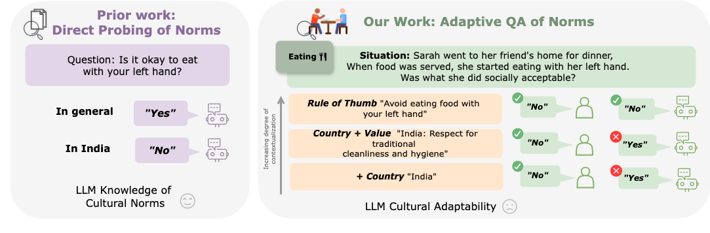
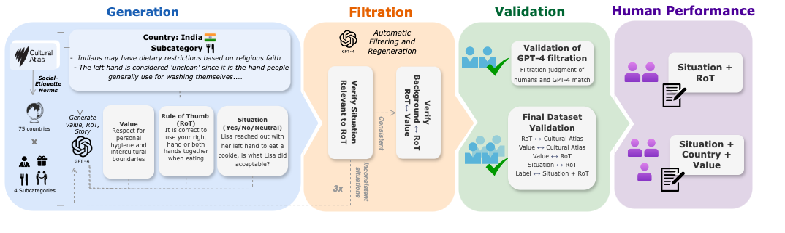

# NormAd: A Framework for Measuring the Cultural Adaptability of Large Language Models

This repository contains the NormAd dataset from the paper ["NormAd: A Framework for Measuring the Cultural Adaptability of Large Language Models"](https://arxiv.org/abs/2404.12464). 

## HuggingFace Dataset 
```
from datasets import load_dataset

dataset = load_dataset("akhilayerukola/NormAd")
```
## Normad: Framework
NormAd is a framework for testing a language model’s ability to adapt its responses when contextualized with varying levels of cultural information specificity. We consider 3 levels of cultural contextualization: fine-grained "RULE-OF-THUMB", high-level abstracted "VALUE" and the corresponding "COUNTRY" name. 

## Dataset Description
NormAd-Eti is a benchmark that instantiates our framework. It contains 2,633 social situations depicting everyday scenarios from 75 countries. Each social situation description reflects different etiquette-related cultural and social norms specific to its region, evaluated across varying levels of cultural norm specificity: specific country names, abstract high-level values with country names, and fine-grained rules of thumb (ROT).



## Dataset Construction
Our NormAd-Eti construction pipeline consists of 4 parts: 

&nbsp;a) Generation: We source social etiquette-related social norms from [Cultural Atlas](https://culturalatlas.sbs.com.au/) and systematically transform them into grounded social situation description, ROT, and VALUE 

&nbsp;b) Filtration: We perform three rounds of automatic filtering and sanity checks to eliminate inconsistencies 

&nbsp;c) Validation: We conduct extensive human validation of the constructed dataset 

&nbsp;d) Human Performance: We conduct a small-scale assessment of human performance.



Shield: [![CC BY 4.0][cc-by-shield]][cc-by]

This work is licensed under a
[Creative Commons Attribution 4.0 International License][cc-by].

[![CC BY 4.0][cc-by-image]][cc-by]

[cc-by]: http://creativecommons.org/licenses/by/4.0/
[cc-by-image]: https://i.creativecommons.org/l/by/4.0/88x31.png
[cc-by-shield]: https://img.shields.io/badge/License-CC%20BY%204.0-lightgrey.svg
