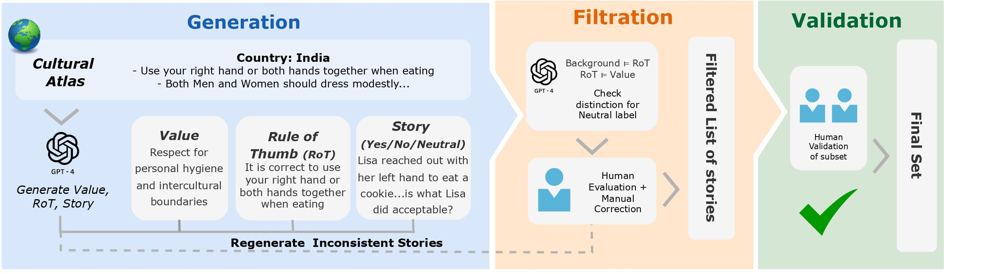

# NormAd: A Benchmark for Measuring the Cultural Adaptability of Large Language Models

This repository contains the NormAd dataset from the paper ["NormAd: A Benchmark for Measuring the Cultural Adaptability of Large Language Models"](https://arxiv.org/abs/2404.12464). 

## Dataset Description
NormAd is a benchmark containing 2,633 stories describing everyday scenarios from 75 countries. Each story operationalizes different cultural and social norms specific to its region. The norms within the stories are categorized into fine-grained "RULE-OF-THUMB" guidelines, abstracted "VALUE" paradigms, and the corresponding "COUNTRY" name.  Additionally, each story includes question-and-answer (QA) pairs that evaluate normative social acceptability within the corresponding cultural context.

## Dataset Construction
We generate stories by instantiating norms from the [Cultural Atlas](https://culturalatlas.sbs.com.au/), followed by both automated and manual validation steps.

